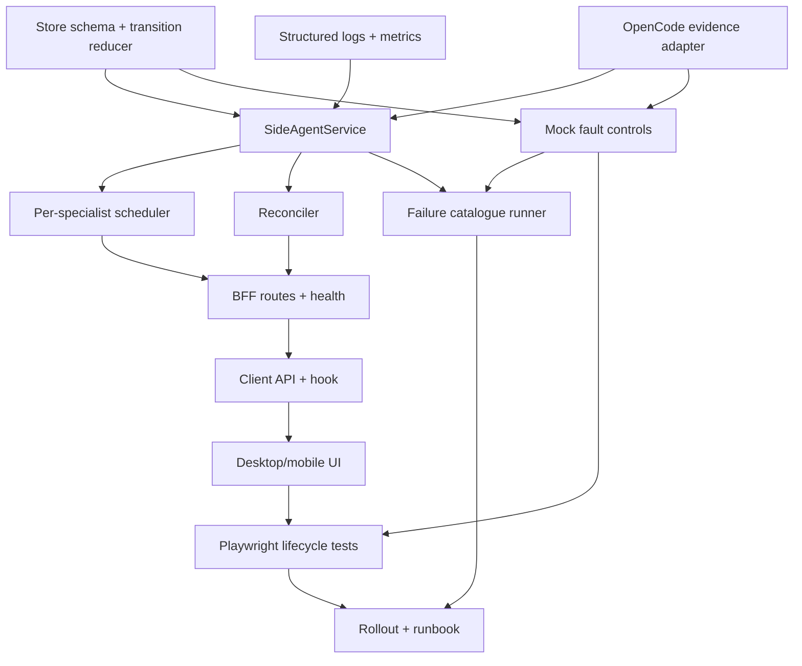

# Persistent side-agent implementation plan

Status: **Proposed**

## Purpose

Implement parent-scoped named specialists backed by persistent OpenCode child sessions. Browser
clients enqueue sequential questions through a durable BFF bridge, inspect completed answers in an
inbox, and explicitly attach selected answers to the parent's next human prompt.

This is not a distributed scheduler, does not make OpenCode execution crash-durable, never
automatically replays ambiguous work, does not replace task-tool sub-agents, and never sends two
concurrent prompts to one specialist session.

## Existing constraints

| Constraint | Required consequence | Evidence |
|---|---|---|
| One OpenCode process serves all projects | Every read/mutation carries canonical absolute `directory` | `server/opencode/client.ts` |
| UI prompts use `prompt_async` | Submission returns before agent completion | `server/opencode/sessions.ts` |
| Classic SSE has no replay | Poll/reconcile durable state; events only accelerate it | `client/lib/useSessionStream.ts` |
| Session status is process-local | Absence after restart is not terminal evidence | `server/opencode/sessions.ts` |
| Policy activation/submission are serialized | Specialist prompt path must preserve the existing critical section | `server/opencode/sessions.ts` |
| Agent tools run as host user | Start read-oriented and preserve fail-closed policy handling | `docs/architecture.md` |
| No speculative dependency | Use Node APIs and existing Pino; JSON V1 until migration triggers | `package.json`, ADR-012 |
| Playwright files share BFF/mock | Every E2E fixture owns unique directory, specialist, question, and reset scope | `tests/e2e-shared-state-ownership.test.ts` |

## Product contract

- A specialist is keyed by canonical directory, parent session, and application specialist ID.
- Each specialist owns one linked child session and one FIFO question queue.
- At most one question is active per specialist.
- Different specialists may run concurrently under a global bound; default `2`, maximum `8`.
- Completed answers enter the parent-owned inbox.
- Accepting creates composer context; only the next human send prompts the parent.
- Every mutation carries an expected revision and supports an idempotency key where retries occur.

## Dependency graph



## Layer contracts

| Layer | Input | Output | Must guarantee | Must not do |
|---|---|---|---|---|
| Route | Browser JSON, canonical directory, idempotency header | Stable DTO/status/error | Validation, ownership, revision checks | Call OpenCode directly |
| Service | Validated commands | Durable transition | Persist before side effect; idempotency | Treat SSE as authoritative |
| Store | Valid mutation | Atomic versioned snapshot | Serialization, validation, retention | Discard corrupt nonterminal work |
| Scheduler | Eligible specialists/questions | Dispatch attempt | FIFO per specialist, fairness, global limit | Prompt one child twice concurrently |
| OpenCode adapter | Child session/question | Transcript/status facts | Directory scope, policy, `prompt_async` | Use blocking `/message` |
| Reconciler | Nonterminal records + upstream facts | Evidence-based transition | Repair missed events/restarts | Infer completion from status absence |
| Client API | BFF DTOs | Typed values | Preserve revision and stable error | Expose raw OpenCode parts |
| UI | Typed state | Responsive controls | Honest uncertainty and stale-state handling | Render interrupted as success/failure |
| Observability | Transition facts | Logs/metrics/health | Correlation and redaction | Log questions, answers, paths, credentials |

## Likely durable model

```ts
interface PersistentSideAgentStoreV1 {
  version: 1
  generation: number
  specialists: SideAgentRecord[]
  questions: SideQuestionRecord[]
  deliveries: AnswerDeliveryRecord[]
  idempotency: IdempotencyRecord[]
}

interface SideAgentRecord {
  id: string
  directory: string
  parentSessionID: string
  childSessionID?: string
  specialistType: string
  name: string
  state: "creating" | "active" | "paused" | "degraded" | "archived"
  nextSequence: number
  revision: number
  createdAt: number
  updatedAt: number
}

interface SideQuestionRecord {
  id: string
  sideAgentID: string
  sequence: number
  prompt: string
  state: "queued" | "submitting" | "running" | "answered" | "failed" |
    "cancelling" | "cancelled" | "interrupted"
  attempt: number
  retryOf?: string
  marker: string
  childUserMessageID?: string
  childAssistantMessageID?: string
  answerSnapshot?: string
  answerDigest?: string
  revision: number
  createdAt: number
  updatedAt: number
  terminalAt?: number
}
```

Persistence loads and validates before dispatch. Missing state initializes empty; malformed or
future state makes only this feature degraded/read-only. Writes use one promise tail, mode `0600`,
unique same-directory temp file, file flush, atomic rename, and best-effort directory flush.

## Submission correlation

Every child question contains a deterministic non-secret marker:

```text
<side-question id="sq_uuid" attempt="1">
```

The service persists `submitting` before calling OpenCode. On timeout/restart it searches that
child transcript for the exact marker. One occurrence establishes acceptance; none remains
interrupted; more than one is an invariant violation that pauses the specialist. A retry always
uses a new question ID/marker and records `retryOf`.

## Reconciliation precedence

1. Correlated assistant turn with error means failed.
2. Correlated assistant turn with completion timestamp means answered.
3. Child status `busy` or `retry` means running.
4. Marked child user turn means submitted/running even if status is absent.
5. Submitting without conclusive response/transcript evidence means interrupted.
6. Previously active question with unfinished turn after OpenCode generation change means interrupted.
7. SSE alone never creates a terminal state.
8. Status absence alone never creates a terminal state.

Each transition records evidence class, revision, timestamp, question/child correlation, and one
structured event.

## Cancellation

- Queued questions cancel locally.
- Persist `cancelling` before aborting active child work.
- Verify parent/child/directory ownership immediately before abort.
- Terminal completion/failure wins a simultaneous cancellation race.
- Transport failure retains cancelling and reconciles later.
- Pausing a specialist prevents new dispatch without implying cancellation.
- Cancelling one question never deletes or archives the specialist session.

## Likely file changes

### Server

| File | Responsibility |
|---|---|
| `server/side-agents/types.ts` | Store schema, DTOs, state/error unions |
| `server/side-agents/transitions.ts` | Pure legal transition reducer |
| `server/side-agents/store.ts` | Versioning, validation, atomic writes, retention |
| `server/side-agents/service.ts` | Commands, idempotency, ownership, revisions |
| `server/side-agents/scheduler.ts` | FIFO per specialist, fair global dispatch |
| `server/side-agents/reconciler.ts` | Startup/periodic transcript reconciliation |
| `server/side-agents/opencode.ts` | Child creation, prompt markers, evidence reads |
| `server/routes/sideAgents.ts` | Parent-scoped browser API and error mapping |
| `server/observability/logger.ts` | Shared Pino configuration/redaction |
| `server/observability/metrics.ts` | Dependency-free bounded metrics registry |
| `server/index.ts` | Construct/start/stop service; route/health registration |
| `.env.example` | Feature, state path, concurrency, reconciliation interval |
| `AGENTS.md` | Durable decisions and API traps |

### Client

| File | Responsibility |
|---|---|
| `client/lib/sideAgents.ts` | DTOs and presentation derivation |
| `client/lib/useSideAgents.ts` | Polling/SSE nudges/revision conflicts |
| `client/components/side-agent-panel.tsx` | Specialist list, inbox, queue and actions |
| `client/components/side-agent-conversation.tsx` | Multi-turn specialist view |
| `client/pages/Conversation.tsx` | Entry point and attached-context composer chips |
| `client/lib/api.ts` | Typed BFF methods only |
| `client/lib/events.ts` | Protocol-marker rendering at the backend-neutral seam |

### Tests

| File | Coverage |
|---|---|
| `tests/side-agent-store.test.ts` | Versioning, atomicity, corruption, retention, permissions |
| `tests/side-agent-transitions.test.ts` | Complete legal/illegal matrix |
| `tests/side-agent-service.test.ts` | Idempotency, ownership, revisions, persist-before-effect |
| `tests/side-agent-reconciler.test.ts` | Missed SSE and crash boundaries |
| `tests/side-agent-scheduler.test.ts` | FIFO, fairness, concurrency, starvation |
| `tests/side-agent-observability.test.ts` | Correlation, redaction, metric bounds |
| `tests/e2e/mock-opencode.ts` | Scoped deterministic failures/status/transcripts |
| `tests/e2e/side-agents.api.spec.ts` | API lifecycle under unique directory |
| `tests/e2e/side-agents.ui.spec.ts` | Desktop/mobile/inbox/uncertainty flow |
| `tests/e2e-shared-state-ownership.test.ts` | Unique reset/directory/specialist ownership |

## Milestones and estimates

| Milestone | Scope | Estimate | Exit gate |
|---|---|---:|---|
| M0 Contract | Live probes, state/API review, threat model | 2-3 days | No unresolved replay/delivery semantics |
| M1 Durable core | Schema, reducer, JSON store, idempotency | 3-4 days | Crash/corruption tests pass |
| M2 OpenCode bridge | Child creation, marked prompts, evidence | 3-4 days | Live and deterministic probes pass |
| M3 Scheduler | FIFO, fairness, cancellation, global bound | 2-3 days | Race/starvation tests pass |
| M4 API/operations | Routes, logs, metrics, health | 2-3 days | Security/operations review passes |
| M5 UI | Specialist conversation, inbox, attachments, mobile | 3-4 days | Desktop/mobile E2E passes |
| M6 Rollout | Flag, migration/rollback drill, soak | 2-3 days | 72-hour soak and rollback |
| Total | Experienced engineer plus reviews | 17-24 engineer-days | All gates met |

## Feature configuration

```text
PERSISTENT_SIDE_AGENTS_ENABLED=false
PERSISTENT_SIDE_AGENT_STORE_FILE=.state/persistent-side-agents.json
PERSISTENT_SIDE_AGENT_MAX_CONCURRENCY=2
PERSISTENT_SIDE_AGENT_RECONCILE_MS=5000
PERSISTENT_SIDE_AGENT_METRICS_ENABLED=false
```

The server enforces the flag; hiding the UI is insufficient.

## Rollout

| Stage | Scope | Gate |
|---|---|---|
| 0 | Merged, flag off | Typecheck, unit, build, E2E |
| 1 | Store validation/read-only health | No creation or dispatch |
| 2 | One allowlisted parent, read-oriented specialist | 48-hour soak; no ambiguity/duplicate |
| 3 | One parent with reviewed Build specialist | Permission and rollback review |
| 4 | All local parents, global concurrency 1 | 72-hour fairness/starvation soak |
| 5 | Default concurrency 2 | SLO, alerts, capacity review |
| 6 | Consider default-on | Explicit maintainer decision |

## Migration and rollback

V1 starts empty and never derives queued work from existing OpenCode sessions. Future store
migrations validate, back up, transform in memory, validate output, then atomically replace. Failure
keeps the original and starts degraded/read-only.

Rollback disables the feature and restarts the BFF. Scheduler/reconciler stop, but state and child
sessions remain. Already accepted OpenCode work may continue. Do not delete queued records or
automatically abort sessions. Previous binaries ignore the new file; after a schema advance prefer
roll-forward rather than writing an older format.

## Review gates

| Gate | Required evidence |
|---|---|
| Contract | Approved interrupted/retry/cancel/delivery meanings |
| OpenCode safety | No blocking `/message`; live repeated-child/permission evidence |
| Durability | Crash-window and corrupt-store tests |
| Security | Ownership, path validation, redaction, private state, no arbitrary child ID |
| Concurrency | One-active-turn and starvation proof |
| UI/accessibility | Mobile, keyboard, honest labels, `data-testid` on controls |
| E2E ownership | Unique fixture/reset keys and static ownership guard |
| Operations | Dashboard, alerts, runbook, rollback drill |
| Release | 72-hour soak with no unresolved P1/P2 scenarios |

## Acceptance criteria

- Acknowledged queued questions survive BFF restart.
- Missed SSE never prevents convergence.
- Ambiguous acceptance never causes automatic duplicate execution.
- One specialist never runs two bridge-owned questions concurrently.
- Same idempotency key cannot create duplicate questions.
- Stale multi-device mutations return 409.
- OpenCode restart yields evidence-based interruption, not guessed success.
- Corrupt durable state fails closed without replacing the source.
- One busy specialist cannot starve another.
- Logs/metrics contain no prompt, answer, raw directory, attachment, token, or credential.
