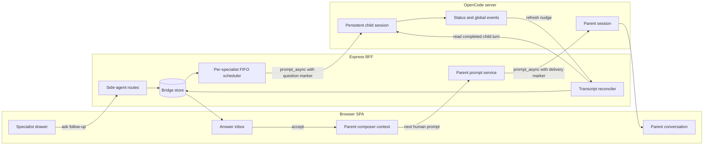
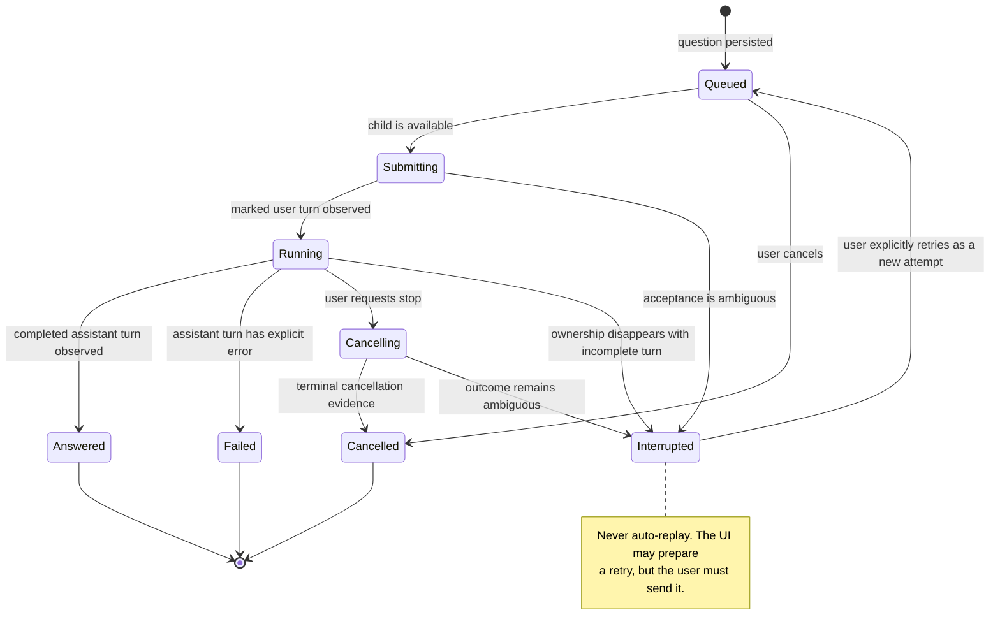
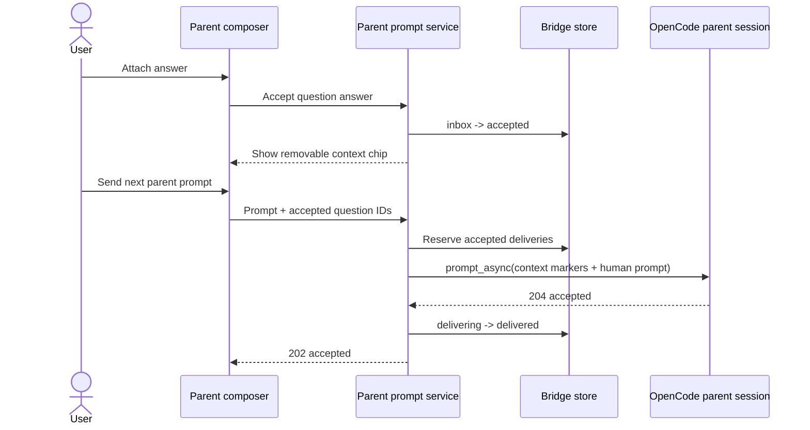
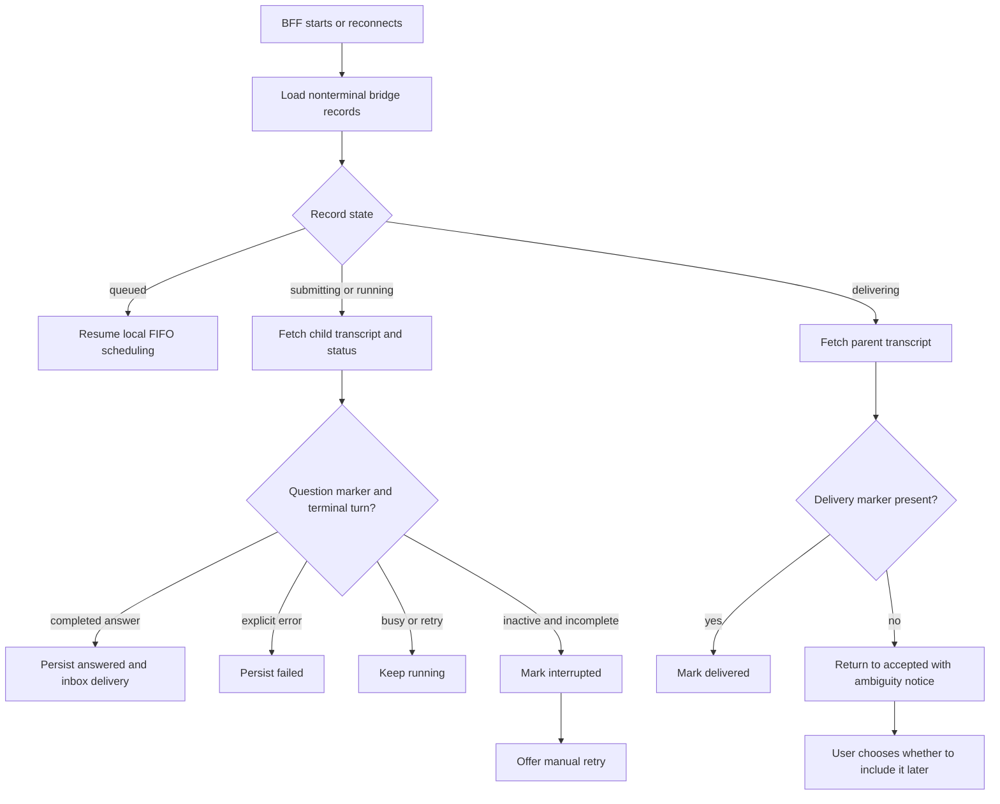

# RFC: Persistent side-agent conversations

Status: **Proposed**

Companion artifacts, executable probes, contracts, security analysis, implementation planning,
operations guidance, and the interactive prototype are collected in the
[persistent side-agent design package](persistent-side-agent-design-package.md).

## Summary

Add named side agents that retain their own OpenCode child session and can answer an arbitrary
number of sequential follow-up questions. Answers remain separate from the parent until the user
explicitly attaches one to the parent's next prompt.

OpenCode already supplies persistent sessions, `parentID`, transcripts, asynchronous prompts,
status, and abort. The missing piece is an application-owned bridge that correlates each question
with one completed child turn, persists delivery state, and recovers honestly after a restart.

The first version should be intentionally conservative:

- one persistent child session per named specialist and parent session;
- one active question at a time per specialist, with FIFO follow-ups;
- a durable answer inbox rather than automatic parent hand-back;
- explicit **Attach to next message**, never automatic parent resume;
- no automatic replay after interruption;
- independent specialists may run concurrently.

## Why the current sub-agent model is insufficient

Today's delegated-work view is a derived lifecycle report, not a message bus or job system. It
combines the parent's task parts, `GET /session/{parent}/children`, the process-local status map,
and bounded child transcript reads. The stable key is a child session ID, and several task parts
for a resumed child deliberately collapse into one row.

That model supports one foreground result or an observed background completion, but it does not
provide:

- a request ID for each follow-up;
- one guaranteed hand-back per child turn;
- answer history in the parent's delegated-work ledger;
- acknowledgment that the parent consumed an answer;
- durable queued, accepted, or delivered state;
- restart reconciliation for an individual exchange.

A direct child prompt also stays in the child transcript. Normal `explore` and `general` children
cannot currently use the browser's Plan/Build-only prompt path. Background hand-backs are an
upstream user-role message recognized by text heuristics, so they are not a sufficient protocol
for repeated conversations.

See [Sub-agents and child sessions](subagents.md) for the implemented behavior and evidence limits.

## Goals

1. Reuse one specialist's context across many sequential questions.
2. Correlate every question with exactly one child assistant turn or an honest terminal failure.
3. Keep completed answers visible to the parent without silently changing parent context.
4. Recover queued, running, answered, and accepted work after BFF restart.
5. Preserve directory and parent-child ownership checks for every mutation.
6. Provide useful desktop and mobile interaction without requiring the child transcript route.

## Non-goals

- A general cross-session message broker.
- One specialist shared across projects or unrelated parent sessions.
- Concurrent turns inside one child session.
- Automatic replay of interrupted questions.
- Automatic parent resume when a child answers.
- Replacing task-tool delegation for one-shot foreground work.
- Guaranteeing exactly-once execution across an OpenCode crash.

## Proposed system



*Figure 1. OpenCode remains the session and transcript owner. The BFF owns only correlation,
scheduling, inbox state, and explicit parent delivery.*

### Failure boundary

```text
Browser SPA                  Express BFF                 opencode serve
    |                             |                            |
    | ask specialist              |                            |
    |---------------------------->| persist queued question    |
    |                             |--------------------------->|
    |                             |       prompt_async         |
    |                             |                            |----> model provider
    |                             |                            |
    |       safe to retry         |     unsafe to replay       X provider/process loss
    |<--------------------------->|                            X
    |   bridge reads/mutations    |                            X
    |                             |
    |                             v
    |                       .state bridge file
    |                       survives BFF restart

The BFF may retry idempotent bridge operations and transcript reconciliation.
It must not automatically replay a question once OpenCode may have accepted it.
```

*Figure 2. The bridge can recover its own state, but it cannot prove that an interrupted model
turn had no side effects. Recovery is therefore detection-only.*

## Components

### SideAgentService

Creates and validates a named specialist backed by an explicitly parent-linked OpenCode session.
It maps a bounded server-side specialist type to an allowed OpenCode agent; the browser cannot
submit an arbitrary agent or permission policy.

Before implementation, a live probe must establish that explicit `parentID` creation plus direct
prompts has the required child-list and permission behavior. If it does not, creation must use a
native task-tool path and capture the resulting child session ID instead.

### Question scheduler

Maintains one queue per side agent. It submits only when that child has no bridge-owned active
question and OpenCode does not positively report it as busy. Queues for different children are
independent.

The current prompt lock protects policy activation and submission only; it ends when
`prompt_async` returns. The new scheduler must cover the full bridge-owned turn, from queued
submission through terminal transcript evidence.

### Transcript reconciler

Treats SSE as a refresh nudge, never as result delivery. It fetches the child transcript and
matches a deterministic question marker to the assistant turn that follows it. Polling repairs
missed classic SSE events, which have no replay cursor.

### Bridge store

Persists side-agent identity, question state, answer snapshots, and parent-delivery state. For the
single-BFF first version, use a versioned atomic JSON file under `.state/`, following notification
history's write-and-rename pattern and process-local mutation serialization.

OpenCode remains authoritative for full transcripts. The bridge store contains enough bounded
data to render the inbox and reconcile after restart. A future multi-BFF deployment or materially
larger history should move this state to SQLite rather than extending the JSON design.

## Data model

```ts
interface SideAgentRecord {
  id: string
  directory: string
  parentSessionID: string
  childSessionID: string
  name: string
  specialistType: string
  state: "active" | "archived"
  createdAt: number
}

interface SideQuestionRecord {
  id: string
  sideAgentID: string
  prompt: string
  state:
    | "queued"
    | "submitting"
    | "running"
    | "answered"
    | "failed"
    | "cancelling"
    | "cancelled"
    | "interrupted"
  childUserMessageID?: string
  childAssistantMessageID?: string
  answer?: string
  error?: string
  createdAt: number
  completedAt?: number
}

interface AnswerDeliveryRecord {
  questionID: string
  state: "inbox" | "accepted" | "delivering" | "delivered" | "dismissed"
  parentMessageID?: string
  acceptedAt?: number
  deliveredAt?: number
}
```

Question IDs, not task-part IDs, are the exchange key. The side-agent ID is an application ID;
the child session ID remains the durable OpenCode relationship key.

## Correlation protocol

`prompt_async` returns no answer or message ID, so the submitted child prompt needs a durable
marker that survives in the transcript:

```text
<side-question id="sq_123" side-agent="sa_architect">
Compare atomic JSON and SQLite for this bridge.
</side-question>
```

The transcript adapter should render the enclosed question normally while hiding protocol markup.
The reconciler finds the marked user turn, waits for its corresponding completed assistant turn,
and records both message IDs. A later assistant turn must never be assigned merely because it is
the child's newest message.

Markers provide correlation and retry detection; they do not create exactly-once execution. If a
process dies after OpenCode accepts the prompt but before the bridge observes the user message, the
record becomes `interrupted` unless reconciliation later finds that marker. It is never
automatically resubmitted.

## Question lifecycle



*Figure 3. Missing process status is not completion. Ambiguous execution becomes interrupted.*

## End-to-end question sequence

```mermaid
sequenceDiagram
    actor User
    participant UI as Browser SPA
    participant BFF as SideAgentService
    participant Store as Bridge store
    participant OC as OpenCode
    participant Child as Child session

    User->>UI: Ask follow-up
    UI->>BFF: POST question + idempotency key
    BFF->>Store: Persist queued question
    BFF-->>UI: 202 + question ID
    BFF->>OC: Check child ownership and status
    BFF->>Child: prompt_async(marked question)
    Child-->>BFF: 204 accepted
    BFF->>Store: Mark submitting
    OC-->>BFF: message/session SSE nudge
    BFF->>Child: Fetch transcript
    BFF->>Store: Record child user message; mark running
    OC-->>BFF: completion SSE nudge
    BFF->>Child: Fetch completed assistant turn
    BFF->>Store: Save answer; create inbox delivery
    BFF-->>UI: Side-agent answer nudge
    UI->>BFF: GET authoritative side-agent state
    UI-->>User: Show answer ready
```

*Figure 4. The HTTP transcript is authoritative; events only accelerate reconciliation.*

## Parent delivery

Answer completion does not write to or wake the parent. The user chooses **Attach to next
message**, which places a removable context chip above the parent composer. On the next human
submission, accepted answers are included in a structured context block:

```text
<side-agent-context question-id="sq_123"
                    child-session="ses_specialist"
                    child-turn="msg_answer">
The specialist's answer...
</side-agent-context>

The human's parent prompt follows here.
```

The parent transcript adapter should render this as an attached-context card followed by the
human prompt. It must not present bridge text as something the human typed.



*Figure 5. Attaching context is explicit, and the next human send is the only action that starts
the parent turn.*

Delivery is effectively-once rather than strictly exactly-once. A deterministic marker allows
restart reconciliation to discover that a parent prompt already contains an answer before a
delivery is retried. If the outcome cannot be proven, show it as ambiguous and let the user decide;
do not send another parent prompt automatically.

## Proposed BFF API

All routes remain directory-scoped and verify that each child still has the addressed parent.

```text
GET    /api/sessions/:parentID/side-agents
POST   /api/sessions/:parentID/side-agents
PATCH  /api/sessions/:parentID/side-agents/:sideAgentID

GET    /api/sessions/:parentID/side-agents/:sideAgentID/questions
POST   /api/sessions/:parentID/side-agents/:sideAgentID/questions
POST   /api/sessions/:parentID/side-agents/:sideAgentID/questions/:questionID/cancel
POST   /api/sessions/:parentID/side-agents/:sideAgentID/questions/:questionID/accept
POST   /api/sessions/:parentID/side-agents/:sideAgentID/questions/:questionID/dismiss
```

Mutating requests accept an idempotency key. The server, not the browser, chooses the child agent
and constructs protocol markers. Abort repeats the current child-ownership check before forwarding
to OpenCode.

## UI and interaction design

### Parent conversation

Add **Specialists** beside the existing delegated-work controls. Its badge counts answers waiting
in the parent inbox, not running children. Opening it shows named specialists, latest activity,
queue depth, and answer-ready state.

```text
+---------------- Parent conversation ----------------+----------------------+
| Transcript                                           | Specialists        2 |
|                                                      |                      |
| Parent and agent messages                            | Architecture         |
|                                                      | Answer ready         |
|                                                      |                      |
|                                                      | Test reviewer        |
|                                                      | Running              |
|                                                      |                      |
| [Architecture answer attached x]                     | [+ New specialist]   |
| [Ask the parent...]                           [Send] |                      |
+------------------------------------------------------+----------------------+
```

### Specialist conversation

The specialist drawer is a conversational history, not the existing one-row lifecycle ledger.
Each completed answer offers **Attach to parent** and **Dismiss**. Running and queued questions show
their honest state and eligible cancellation action.

```text
+---------------- Architecture specialist ----------------+
| Persistent child ses_specialist              [Transcript]|
+----------------------------------------------------------+
| You                                                      |
| Compare atomic JSON and SQLite.                          |
|                                                          |
| Specialist                                               |
| Atomic JSON fits a single-process v1 because...          |
|                                  [Attach to parent]       |
|                                                          |
| You                                                      |
| What changes with two BFF processes?          Running    |
+----------------------------------------------------------+
| Ask a follow-up...                                [Send]  |
+----------------------------------------------------------+
```

### Mobile

On narrow viewports, open the specialist conversation as a full-screen sheet with an explicit
back action. Keep answer actions near the answer and preserve the parent draft when switching.

```text
+----------------------------+
| < Parent   Architecture     |
|             specialist     |
+----------------------------+
| You                        |
| Compare JSON and SQLite.   |
|                            |
| Specialist                 |
| Atomic JSON fits v1...     |
| [Attach to parent]         |
|                            |
| Answer attached to parent  |
+----------------------------+
| Ask a follow-up...  [Send] |
+----------------------------+
```

### Visible states

Use the same state names across the list, conversation, and inbox: **Queued**, **Running**,
**Answer ready**, **Attached**, **Delivered**, **Cancelling**, **Cancelled**, **Interrupted**, and
**Failed**. Do not use `unknown`, `idle`, or a missing status as a friendly synonym for completed.

## Recovery and reconciliation



*Figure 6. Restart recovery reconciles durable transcripts and never interprets absence as safe
permission to replay.*

## Safety and limits

- Verify canonical directory scope and `child.parentID === parentID` before prompt or abort.
- Map specialist types server-side; reject arbitrary browser-provided agent identities.
- Preserve resolved OpenCode agent policy. Do not use legacy `prompt_async.tools` overrides.
- Validate child permission behavior live before shipping mutating specialist types. Start with a
  read-oriented specialist if the inheritance contract remains uncertain.
- Bound question text, answer snapshots, retained history, and list pagination.
- Serialize store writes and turns per side-agent ID.
- Never treat a background task part, missing status, or generic idle event as an answer.
- Never automatically resend a question or parent delivery after an ambiguous failure.

## Live probes required before implementation

1. Create a session with explicit `parentID` and confirm it appears in the parent's child list.
2. Prompt that child repeatedly with the intended specialist agent and inspect retained context.
3. Confirm message IDs and ordering around `prompt_async` marker insertion.
4. Probe a second prompt while the child is busy; the design must not depend on its behavior.
5. Abort a running child and record status, transcript, and event evidence.
6. Inspect permissions on creation and repeated turns, including a parent that switched modes.
7. Restart OpenCode during a child turn and verify the incomplete transcript shape.
8. Delete or archive a parent and observe explicitly linked child behavior.

## Verification strategy

### Unit tests

- legal question and delivery state transitions;
- per-child FIFO scheduling and cross-child concurrency;
- marker creation, parsing, and answer-turn correlation;
- duplicate mutation idempotency;
- restart reconciliation and ambiguous acceptance;
- bounded persistence and malformed-store handling;
- parent-child ownership validation.

### API tests

- create and reuse one named specialist;
- retain context across several sequential questions;
- reject concurrent bridge-owned turns for one child;
- run different specialists concurrently;
- cancel queued and running questions;
- attach an answer to one parent prompt only;
- reject forged directories, child IDs, question IDs, and specialist types.

### End-to-end tests

- desktop drawer, answer inbox, context chips, and transcript links;
- mobile full-screen specialist conversation and preserved parent draft;
- refresh while queued, running, answered, and accepted;
- missed SSE repaired by polling;
- BFF restart with nonterminal questions and deliveries;
- OpenCode restart producing **Interrupted**, never automatic replay.

Each E2E file must own unique mock directories, child sessions, and bridge records. Reset endpoints
must clear only the caller's named scope because Playwright files share one BFF and one mock.

## Rollout

1. **Probe:** verify the live OpenCode contracts above and record fixtures.
2. **Bridge foundation:** add types, atomic store, scheduler, reconciliation, and API tests.
3. **Specialist UI:** add named specialists, multi-turn questions, cancellation, and mobile flow.
4. **Answer inbox:** add explicit accept/dismiss and parent composer context chips.
5. **Hardening:** restart tests, retention limits, observability, and documentation updates.

Feature-gate the first release. Existing task-tool children and the delegated-work panel remain
unchanged until the bridge has independent production evidence.

## Alternatives considered

| Alternative | Decision |
|---|---|
| Depend on background hand-back messages | Rejected. They are completion-oriented, heuristic, and not correlated per turn. |
| Prompt the child directly and make users copy answers | Useful today, but it does not keep the parent informed or provide an answer inbox. |
| Automatically inject every answer and resume the parent | Rejected. It creates race, replay, cost, and side-effect risk without user intent. |
| Create one child per question | Rejected for this feature because it loses specialist conversational context; retain it for one-shot tasks. |
| Share one global specialist across parents/projects | Deferred. Cross-project context and permission isolation require a stronger tenancy model. |
| Store bridge state only in browser local storage | Rejected. Other devices and BFF restart reconciliation need server-owned state. |

## Decision

Proceed only after the live probes confirm a safe persistent-child prompt path. Implement the
application-owned FIFO bridge and explicit answer inbox rather than extending the current derived
sub-agent ledger or depending on synthetic hand-backs.
